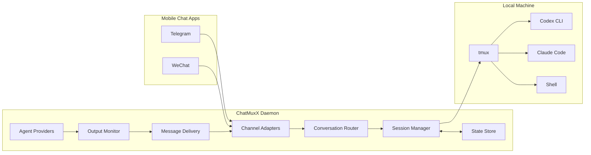
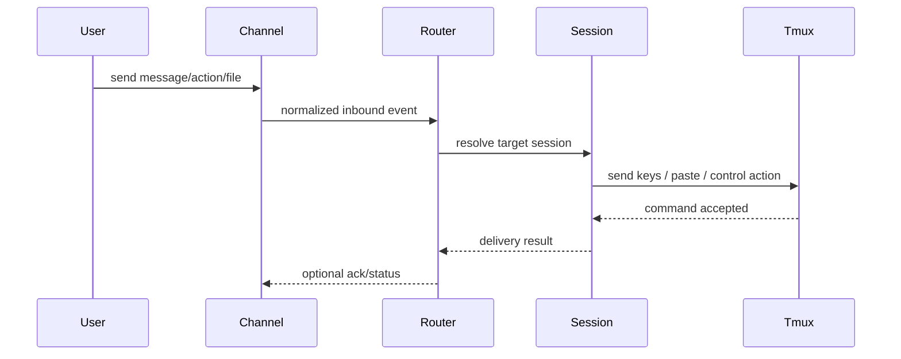
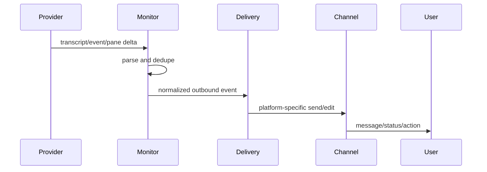

# Architecture

Status: draft. This architecture is a starting proposal, not a final decision.

## High-Level Shape



## Core Modules

### Channel Adapters

Responsibilities:

- Authenticate and connect to a mobile chat platform.
- Normalize inbound messages into a common internal event.
- Send outbound text, files, images, and action controls.
- Hide platform-specific mechanics such as Telegram topics or WeChat `context_token`.

Candidate adapters:

- `telegram`: Bot API adapter.
- `wechat`: iLink/OpenClaw adapter.

### Conversation Router

Responsibilities:

- Map channel conversations to internal sessions.
- Enforce authorization.
- Interpret channel-specific callbacks or commands.
- Decide whether an inbound event is text, action, file, voice, or session-management intent.

Internal identity should use stable ChatMuxX session IDs, with channel-specific bindings stored separately.

### Session Manager

Responsibilities:

- Bind a ChatMuxX session to a tmux window or pane.
- Persist binding metadata.
- Re-resolve stale tmux windows when possible.
- Centralize all state mutation.

Key rule:

- Raw tmux operations should stay behind a tmux boundary module.

### Agent Providers

Responsibilities:

- Describe provider capabilities.
- Discover transcript or event sources.
- Parse provider-specific output.
- Normalize interactive prompts and status.
- Define launch/resume/continue behavior when supported.

Candidate providers:

- `codex`
- `claude`
- `shell`
- TBD: `gemini`, `pi`, custom providers.

### Output Monitor

Responsibilities:

- Poll or subscribe to provider outputs.
- Track read offsets.
- Convert provider deltas into normalized outbound events.
- Avoid duplicate delivery after restart.

Sources may include:

- Provider transcript files.
- Hook/event files.
- Tmux pane capture.

### Message Delivery

Responsibilities:

- Rate-limit outbound messages.
- Split messages according to channel limits.
- Preserve ordering.
- Render actions as platform-specific controls.
- Fall back gracefully when rich formatting fails.

### State Store

Responsibilities:

- Store config-independent runtime state in local files.
- Use atomic writes.
- Keep data human-inspectable.
- Support migration when schemas change.

Candidate state files:

- `state.json`: session bindings and channel bindings.
- `monitor_state.json`: output offsets.
- `accounts.json`: channel login/account metadata, if not delegated to a channel SDK.

## Inbound Flow



## Outbound Flow



## Channel Binding Model

Proposed internal model:

```text
ChannelAccount
  id
  channel_type
  credentials_ref

ChannelConversation
  id
  channel_type
  external_conversation_id
  account_id

ChatMuxXSession
  id
  tmux_session
  tmux_window_id
  tmux_pane_id
  provider
  workspace
  status

Binding
  conversation_id
  session_id
```

This keeps WeChat and Telegram differences out of the core session model.

## WeChat-Specific Notes

- Store the latest `context_token` per WeChat conversation binding so replies can attach correctly.
- Store and advance `get_updates_buf` per logged-in WeChat account.
- Treat `group_id` and `from_user_id` carefully when deriving conversation identity.
- Decide whether direct iLink calls or OpenClaw runtime integration owns login and account persistence.

## Telegram-Specific Notes

- Telegram forum topic ID maps cleanly to a channel conversation ID.
- Inline keyboards can represent prompts, quick keys, and recovery actions.
- Message length and formatting limits should be handled in delivery, not parser code.

## Implementation Risks

- WeChat conversation identity may not map as cleanly as Telegram topics.
- Provider transcript formats can change.
- Terminal scraping is useful but less reliable than provider-native transcripts or hooks.
- File/media support crosses channel APIs, local storage, security filtering, and provider UX.
- Multi-user support affects authorization, auditability, and session ownership deeply.

