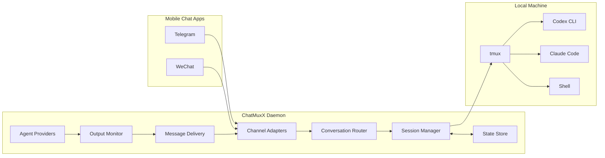
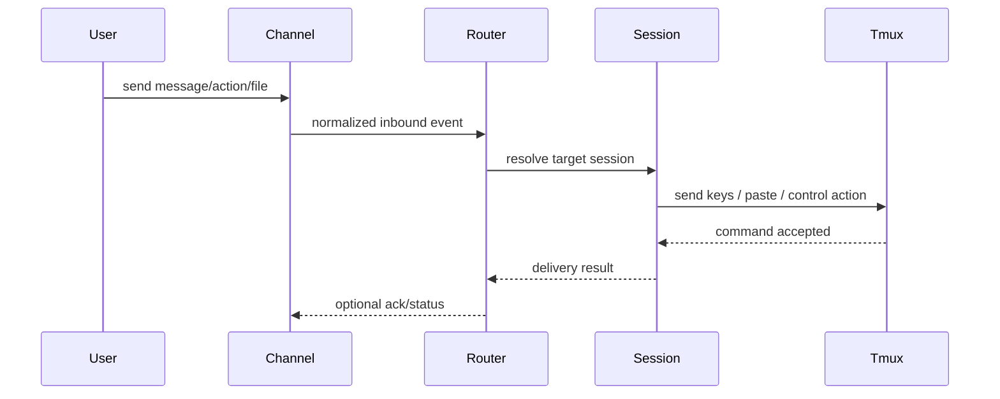
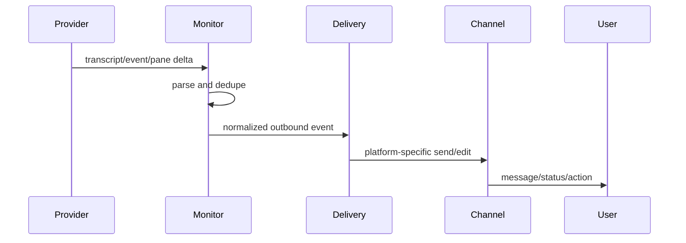

# Architecture

Status: draft. This architecture is a starting proposal, not a final decision.

## High-Level Shape



## Confirmed Architecture Direction

- ChatMuxX uses channel adapters for chat applications and provider adapters for local CLI applications.
- ChatMuxX core is Rust-first, prioritizing safety, stability, typed boundaries, and long-term maintainability.
- WeChat is the first channel implementation, but core modules must not become WeChat-specific.
- A channel adapter must not know tmux details. It only handles platform authentication, inbound/outbound message transport, platform capabilities, and platform-specific metadata.
- A provider adapter must not know WeChat, Telegram, or any chat-platform details. It only handles CLI launch, resume/continue behavior, output discovery, prompt/status parsing, and provider-specific capabilities.
- All direct tmux operations should stay behind a tmux boundary module.

## Runtime Choice

ChatMuxX should use Rust for the core daemon and CLI.

Reasons:

- Strong typed boundaries help keep channel adapters, provider adapters, sessions, and tmux operations separate.
- A long-running local daemon benefits from Rust's memory safety and predictable resource ownership.
- A single static binary is convenient for local installation and future distribution.
- `tokio`, `reqwest`, and `serde` cover the main runtime needs: async HTTP long polling, JSON APIs, local state, and event handling.
- Provider transcript parsing and state migrations benefit from explicit data models.

Tradeoffs:

- v0.1 development will be slower than Go, Python, or Node.js.
- Some chat applications may only have mature SDKs in Node.js or Python.
- To avoid locking every integration into Rust, ChatMuxX should support external connector processes for future channels that are easier to implement outside the Rust core.

Initial Rust module direction:

- `channel`: channel adapter traits and built-in channel implementations.
- `channel/wechat`: WeChat iLink adapter.
- `connector`: external connector process protocol for future chat apps.
- `provider`: provider adapter traits and built-in Codex, Claude Code, and Shell providers.
- `session`: session model, bindings, lifecycle, and recovery.
- `tmux`: all tmux command execution and pane/window inspection.
- `monitor`: output polling, offset tracking, and normalized events.
- `delivery`: outbound message rendering, splitting, action fallback, and rate limits.
- `state`: local state files, atomic writes, and migrations.
- `cli`: command-line entrypoints exposed through the `cmux` binary.

## Core Modules

### Channel Adapters

Responsibilities:

- Authenticate and connect to a mobile chat platform.
- Normalize inbound messages into a common internal event.
- Send outbound text, files, images, and action controls.
- Hide platform-specific mechanics such as Telegram topics or WeChat `context_token`.

Candidate adapters:

- `telegram`: Bot API adapter.
- `wechat`: direct iLink HTTP adapter.

Channel adapters should expose internal events instead of platform-native message objects:

- `InboundText`: user text from a channel conversation.
- `InboundAction`: user selected an action, button, command, or fallback reply.
- `InboundFile`: user sent a file or media item that should become a local artifact.
- `ConversationStarted`: a new channel conversation needs onboarding or binding.
- `ConversationBound`: a channel conversation was bound to a ChatMuxX session.
- `ChannelAccountExpired`: channel credentials expired or need re-login.

Outbound delivery should use channel capabilities rather than hardcoded UI assumptions:

- If the channel supports buttons, render actions as buttons.
- If the channel does not support buttons, render numbered choices, command text, or confirmation codes.
- If the channel cannot edit messages, send replacement status messages.
- If the channel has strict media or rate limits, delivery should degrade to text summaries or local file paths where appropriate.

### Conversation Router

Responsibilities:

- Map channel conversations to internal sessions.
- Enforce authorization.
- Interpret channel-specific callbacks or commands.
- Decide whether an inbound event is text, action, file, voice, or session-management intent.

Internal identity should use stable ChatMuxX session IDs, with channel-specific bindings stored separately.

Authorization rules for v0.1:

- ChatMuxX is controlled by one owner.
- Owner identity may be initialized during WeChat login/pairing and may also be configured explicitly in `config.toml`.
- If an owner is already configured or persisted, inbound WeChat messages and commands must match that owner identity.
- In group chats, `from_user_id` must be checked against the owner identity even when the conversation identity includes `group_id`.
- Unapproved users must not be able to create, switch, close, or send input to sessions.

High-impact action confirmation:

- `cmux close` requires confirmation.
- Provider replacement requires confirmation.
- Recovery replacement/fresh actions require confirmation.
- `cmux interrupt` requires confirmation in v0.1.
- `cmux esc` and `cmux enter` do not require confirmation.

### Session Manager

Responsibilities:

- Bind a ChatMuxX session to a tmux window or pane.
- Persist binding metadata.
- Re-resolve stale tmux windows when possible.
- Centralize all state mutation.

Key rule:

- Raw tmux operations should stay behind a tmux boundary module.

Tmux ownership rules:

- v0.1 should use one managed tmux session, defaulting to `chatmuxx`.
- ChatMuxX-created windows should live inside the managed tmux session.
- ChatMuxX may discover and bind unbound windows inside the managed tmux session.
- Closing from mobile chat should only close windows that ChatMuxX created or explicitly adopted.
- ChatMuxX should not kill arbitrary windows in unrelated user tmux sessions.
- Future multi-user support may allocate one tmux session per user, or one shared tmux session per group/team.

### Agent Providers

Responsibilities:

- Describe provider capabilities.
- Discover transcript or event sources.
- Parse provider-specific output.
- Normalize interactive prompts and status.
- Define launch/resume/continue behavior when supported.

Candidate providers:

- `codex`
- `claude`
- `shell`
- Future: `gemini`, `pi`, custom providers.

Shell provider v0.1 behavior:

- Shell uses raw command/text interaction only.
- ChatMuxX should not generate shell commands from natural language.
- Natural-language-to-command generation is not a planned goal unless explicitly reopened later.

### Output Monitor

Responsibilities:

- Poll or subscribe to provider outputs.
- Track read offsets.
- Convert provider deltas into normalized outbound events.
- Avoid duplicate delivery after restart.

Sources may include:

- Provider transcript files.
- Tmux pane capture.

Provider monitoring strategy for v0.1:

- Shell uses tmux pane capture as the primary source because plain shell sessions do not have a standard transcript format.
- Codex should prefer structured transcript/JSONL data when available, with tmux pane capture as a fallback.
- Claude Code should prefer transcript/status parsing when available, with tmux pane capture as a fallback.
- ChatMuxX should not install Claude/Codex hooks, plugins, skills, or configuration changes in v0.1. Provider integrations should keep external CLI app configurations clean.
- Structured sources are preferred because they preserve agent events more precisely than terminal text: assistant messages, tool activity, approvals, errors, completion state, and resume metadata.
- Tmux pane capture remains necessary as a universal fallback and for providers without structured output.
- All source-specific output should normalize into a shared `ProviderEvent` model before delivery.

Candidate `ProviderEvent` types:

- `AssistantMessage`
- `StatusChanged`
- `PromptRequested`
- `ToolActivity`
- `CommandOutput`
- `SessionStarted`
- `SessionFinished`
- `SessionFailed`

### Message Delivery

Responsibilities:

- Rate-limit outbound messages.
- Split messages according to channel limits.
- Preserve ordering.
- Render actions as platform-specific controls.
- Fall back gracefully when rich formatting fails.

v0.1 delivery behavior:

- Send primary assistant output as original text where possible.
- Throttle status updates to avoid chat spam.
- Split long output into multiple messages before truncating.
- If output remains too long, truncate and hint that the user can run `cmux screenshot` to inspect the current terminal.
- Do not automatically summarize output in v0.1.

### State Store

Responsibilities:

- Store config-independent runtime state in local files.
- Use atomic writes.
- Keep data human-inspectable.
- Support migration when schemas change.

Candidate state files:

- `state.json`: session bindings and channel bindings.
- `monitor_state.json`: output offsets.
- `accounts.json`: channel login/account metadata, if not delegated to a channel SDK.
- `history.jsonl`: local chat/session history for user input, provider output, and session lifecycle events.

Storage decision for v0.1:

- Use local files instead of a database.
- Keep configuration in `config.toml`.
- Keep runtime state in `state.json`.
- Keep monitor offsets in `monitor_state.json`.
- Keep channel account metadata and initial WeChat token storage in `accounts.json`.
- Keep chat/session history separate from runtime logs and credential files.
- Use restrictive file permissions for sensitive state such as account tokens.
- Every persisted file should include a `schema_version`.
- All reads and writes must go through the `state` module. Business modules should not directly edit JSON files.
- Writes should be atomic: write a temporary file, fsync where practical, then rename.

Security and redaction:

- Default config/state directory should be `~/.chatmuxx`.
- State directory permissions should be `0700`.
- Files containing credentials or account tokens should use `0600`.
- Runtime logs must not include tokens, `Authorization` headers, `context_token`, `typing_ticket`, upload URLs, or raw credential payloads.
- Chat/session history may store user inputs, provider outputs, and session lifecycle events, but must not store credential fields or sensitive protocol headers.
- Sensitive IDs in logs should be masked where practical.
- `cmux doctor` should check state directory and credential file permissions.

Future storage direction:

- Add a storage backend interface so the file implementation can later be replaced or supplemented.
- Consider SQLite when ChatMuxX needs richer state queries, message history, multi-user ownership, audit logs, or larger event storage.
- Consider OS keychain integration for channel credentials and tokens.

## CLI Surface

The project name is ChatMuxX. The CLI binary should use the short command name `cmux`.

Initial v0.1 commands:

- `cmux daemon`: run the ChatMuxX daemon in the foreground. It should create or attach the managed `chatmuxx` tmux session from any terminal.
- `cmux login wechat`: start WeChat QR login and persist iLink account credentials.
- `cmux doctor`: validate config, tmux availability, provider commands, state files, and WeChat login status.
- `cmux config init`: create an initial `config.toml`.
- `cmux sessions list`: list known ChatMuxX sessions and managed tmux windows.
- `cmux sessions close <session-id>`: close a managed session/window.

Future commands:

- `cmux logout wechat`
- `cmux sessions switch <session-id>`
- `cmux sessions recover <session-id>`
- `cmux state migrate`
- `cmux connector run <name>`

Service installation through launchd/systemd is deferred until after v0.1.

## Mobile Command Model

Mobile chat commands must be clearly separated from provider-native commands.

ccgram uses Telegram bot-native `/...` commands first, then forwards unknown `/...` commands to the current provider. That works for Telegram, but it mixes bridge commands with Claude/Codex slash commands and is not a good fit for ChatMuxX's multi-channel design.

ChatMuxX should use `cmux ...` as the canonical mobile command prefix:

- `cmux help`
- `cmux new`
- `cmux sessions`
- `cmux switch`
- `cmux close`
- `cmux screenshot`
- `cmux esc`
- `cmux interrupt`
- `cmux enter`
- `cmux provider`
- `cmux recover`

These commands are mandatory for v0.1. File, live-view, voice, and rich command-discovery commands are deferred.

Command routing rules:

- Messages beginning with `cmux ` are ChatMuxX bridge commands.
- Messages beginning with `/` are provider-native slash commands and should be forwarded to the active provider when a session is bound.
- Plain text that is not in an active ChatMuxX UI flow is forwarded to the active provider.
- During onboarding, recovery, or session selection flows, numbered replies and short action tokens are interpreted as ChatMuxX actions.
- `/cmux ...` may be accepted as an optional alias on channels that strongly encourage slash commands, but `cmux ...` remains the portable canonical form.
- ChatMuxX help text should teach users to use `cmux help` for bridge commands and provider-native `/help` for the active CLI when supported.

## Inbound Flow



## Outbound Flow



## Channel Binding Model

Proposed internal model:

```text
ChannelAccount
  id
  channel_type
  credentials_ref

ChannelConversation
  id
  channel_type
  external_conversation_id
  account_id

ChatMuxXSession
  id
  tmux_session
  tmux_window_id
  tmux_pane_id
  provider
  workspace
  status

Binding
  conversation_id
  session_id
```

This keeps WeChat and Telegram differences out of the core session model.

Identity rules:

- `ChatMuxXSession.id` is the stable internal session identity.
- tmux window and pane IDs are runtime attachment metadata, not the primary identity.
- A channel conversation binds to `ChatMuxXSession.id`, not directly to a tmux window.
- v0.1 defaults to one WeChat conversation bound to one ChatMuxX session.
- The model should allow multiple channel conversations to bind to the same ChatMuxX session later, enabling cross-channel access without changing the core identity model.
- Recovery may replace tmux metadata while preserving the ChatMuxX session identity when appropriate.

## WeChat-Specific Notes

- ChatMuxX should implement the iLink HTTP API directly. It should not depend on OpenClaw runtime, gateway, plugin installation, or OpenClaw account storage.
- The `openclaw-weixin` reference is used only to understand the exposed iLink interfaces and protocol behavior.
- v0.1 WeChat support should focus on QR login, token persistence, `getupdates` long polling, `sendmessage`, and text conversation flow.
- Store the latest `context_token` per WeChat conversation binding so replies can attach correctly.
- Store and advance `get_updates_buf` per logged-in WeChat account.
- Treat `group_id` and `from_user_id` carefully when deriving conversation identity.
- Use explicit onboarding for unbound WeChat conversations. The first unbound message should guide the owner to create a new session or bind an existing session instead of forwarding text directly to tmux.
- For private chats, the conversation identity is based on the WeChat peer.
- For group chats, the conversation identity should include `group_id`; `from_user_id` should still be checked against the owner authorization model.
- Keep interface space for media, typing indicators, and multi-account support, but do not let them block the first usable text flow.

## Session Switching

ChatMuxX should support switching the active session from within a chat conversation.

Required v0.1 behavior:

- A bound conversation can switch to another existing ChatMuxX session.
- A bound conversation can start a new tmux window with a selected provider, then switch the conversation to that new session.
- Provider selection during new-session creation should include Codex, Claude Code, and Shell.
- Switching sessions changes the conversation's active binding; it should not destroy the old session.
- If a channel supports buttons, session/provider selection may use actions. Otherwise, it must be available through text commands or numbered replies.
- The user must be able to list current manageable tmux windows/sessions from mobile chat.
- The list should support switching to a window/session, closing a window/session, or creating a new one.

Provider switching rules:

- Each managed tmux window should have one active provider identity at a time.
- Default provider switch behavior should replace the current active session: ask for confirmation, close the old managed tmux window, create a new window with the selected provider, and update the current conversation binding.
- v0.1 does not need an archive/keep branch during provider replacement.
- If the user wants to keep the old task, they should choose new-session creation or switch-to-existing-session instead of provider replacement.
- Running multiple tasks remains supported, but it is explicit through the session/window list.
- Switching providers inside the same tmux window is not the standard managed flow because provider state, transcript discovery, prompt parsing, and recovery semantics differ.

Future behavior:

- Multiple channel conversations may point to the same session.
- A single channel conversation may expose a session list/dashboard for quick switching, status, and termination.

## Telegram-Specific Notes

- Telegram forum topic ID maps cleanly to a channel conversation ID.
- Inline keyboards can represent prompts, quick keys, and recovery actions.
- Message length and formatting limits should be handled in delivery, not parser code.

## Implementation Risks

- WeChat conversation identity may not map as cleanly as Telegram topics.
- Provider transcript formats can change.
- Terminal scraping is useful but less reliable than provider-native transcripts/status sources.
- File/media support crosses channel APIs, local storage, security filtering, and provider UX.
- Multi-user support affects authorization, auditability, and session ownership deeply.
